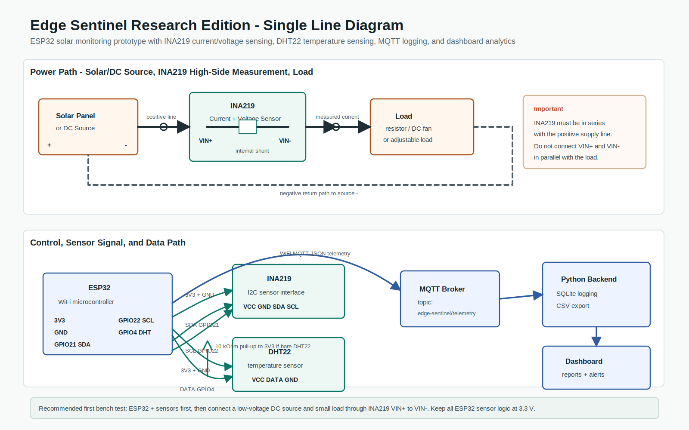
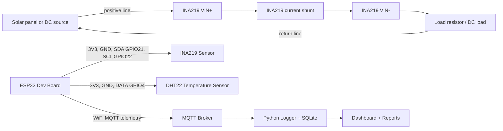

# Circuit and Connection Diagram

This wiring is for the first safe bench prototype of Edge Sentinel Research Edition.

## Engineering Single-Line Diagram

Open or print this diagram:



## Main Connections

| Component | Pin | Connect To | Purpose |
| --- | --- | --- | --- |
| ESP32 | 3V3 | INA219 VCC | Sensor power |
| ESP32 | GND | INA219 GND | Common logic ground |
| ESP32 | GPIO 21 | INA219 SDA | I2C data |
| ESP32 | GPIO 22 | INA219 SCL | I2C clock |
| ESP32 | 3V3 | DHT22 VCC | Sensor power |
| ESP32 | GND | DHT22 GND | Common logic ground |
| ESP32 | GPIO 4 | DHT22 DATA | Temperature signal |
| DHT22 | DATA | 10 kOhm pull-up to 3V3 | Required if using bare DHT22 |
| DC source / solar + | Positive | INA219 VIN+ | Current enters sensor |
| INA219 | VIN- | Load positive | Current leaves sensor |
| Load | Negative | DC source / solar - | Completes power loop |

## Breadboard-Level Diagram

```text
                         LOGIC / SENSOR SIDE

                 +-----------------------------+
                 |            ESP32            |
                 |                             |
                 | 3V3  ----------------+------|----------------+
                 | GND  ----------------|------|----------+-----|
                 | GPIO21 SDA ----------|------|----+     |     |
                 | GPIO22 SCL ----------|------|----|--+  |     |
                 | GPIO4  DHT DATA -----|------|----|--|--|--+  |
                 +----------------------+      |  |  |  |  |  |
                                               |  |  |  |  |  |
                                      +--------v--v--v--+  |  |
                                      |     INA219      |  |  |
                                      | VCC GND SDA SCL |  |  |
                                      | VIN+      VIN-  |  |  |
                                      +--^----------v---+  |  |
                                         |          |      |  |
                                         |          |      |  |
                                      +--+--+    +--+------+--v--+
                                      | DC  |    |     LOAD      |
                                      | +   |    | resistor/fan  |
                                      +-----+    +------+--------+
                                                          |
                                      +-------------------+
                                      |
                                   DC / SOLAR -

                                      +-------------+
                                      |    DHT22    |
                                      | VCC DATA GND|
                                      +--^----^---^-+
                                         |    |   |
                                         |    |   +---- ESP32 GND
                                         |    +-------- ESP32 GPIO4
                                         +------------- ESP32 3V3

                       Add 10 kOhm from DATA to 3V3 if using a bare DHT22.
```

## Mermaid Block Diagram



## Important Electrical Notes

- Use **3.3 V** for INA219 logic and DHT22 power when connected to ESP32.
- Use **GPIO 21 = SDA** and **GPIO 22 = SCL** for the ESP32 I2C bus.
- Use **GPIO 4** for DHT22 data, matching the firmware.
- Put the INA219 in series with the **positive** supply line. Do not connect it in parallel with the load.
- Keep the first tests low power: a small DC supply and load resistor are safer than jumping straight to a real solar panel.
- If using a bare DHT22, add a **4.7 kOhm to 10 kOhm pull-up resistor** between DATA and 3V3. Many DHT22 modules already include this resistor.

## First Test Procedure

1. Connect only ESP32 + INA219 + DHT22.
2. Upload firmware and confirm serial boot.
3. Add the DC source and load through the INA219 current path.
4. Check voltage/current values in serial output or MQTT.
5. Run `python -m backend.logger --mqtt-host YOUR_BROKER_IP`.
6. Open the dashboard after data starts arriving.

## Fault Simulation Wiring Ideas

| Fault | Safe Bench Method |
| --- | --- |
| Normal | Stable DC source and fixed load |
| Open circuit | Disconnect load positive after INA219 VIN- |
| Partial shading | Reduce source voltage/current or partially cover small panel |
| Temperature anomaly | Warm the DHT22 area gently, without flame or direct high heat |
| Current deviation | Switch between two known load resistors |
| Sensor failure | Temporarily disconnect DHT22 DATA or I2C line for a short controlled test |
